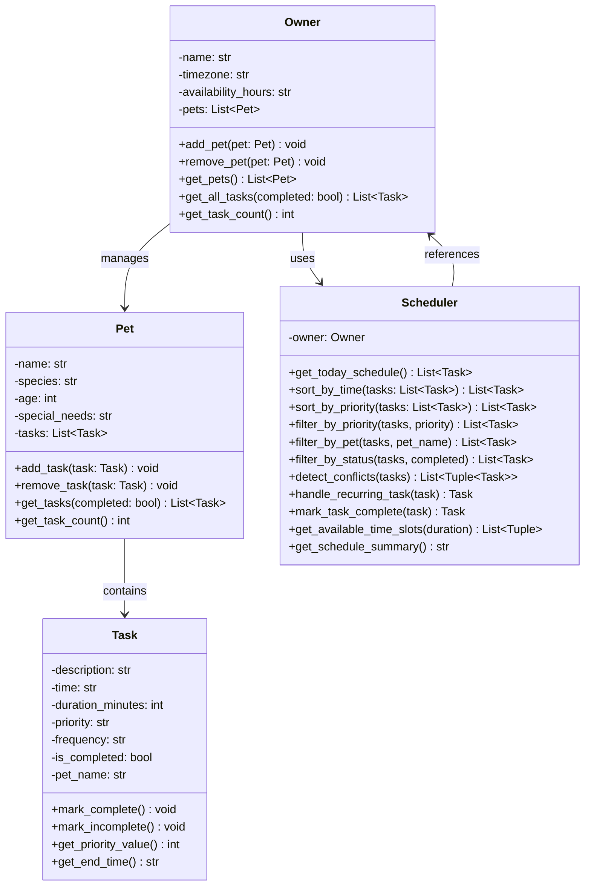

# PawPal+ Project Reflection# PawPal+ Project Reflection


## 1. System Design## 1. System Design


### 1a. Initial Design**a. Initial design**


My system consists of four core classes organized to represent real-world entities and operations:- Briefly describe your initial UML design.

- What classes did you include, and what responsibilities did you assign to each?

**Task** - The fundamental unit of work. Each task represents a single pet care activity with attributes:

- Time (HH:MM format) when the task occurs**b. Design changes**

- Duration in minutes

- Priority level (low, medium, high)- Did your design change during implementation?

- Frequency (one_time, daily, weekly)- If yes, describe at least one change and why you made it.

- Completion status

Methods allow marking complete/incomplete and calculating end times.---


**Pet** - Represents an individual pet with:## 2. Scheduling Logic and Tradeoffs

- Name, species (dog, cat, rabbit, etc.)

- Age and special needs tracking**a. Constraints and priorities**

- A collection of Task objects

Responsible for managing its own tasks through add/remove/filter operations.- What constraints does your scheduler consider (for example: time, priority, preferences)?

- How did you decide which constraints mattered most?

**Owner** - The system's "hub" that manages:

- Multiple Pet objects**b. Tradeoffs**

- Timezone and availability preferences

- Aggregate access to all tasks across all pets- Describe one tradeoff your scheduler makes.

Provides convenient methods to retrieve all tasks or filter across the entire household.- Why is that tradeoff reasonable for this scenario?


**Scheduler** - The "intelligence layer" that:---

- Sorts tasks chronologically and by priority

- Filters tasks by pet, priority, or status## 3. AI Collaboration

- Detects scheduling conflicts

- Handles recurring task regeneration**a. How you used AI**

- Finds available time slots

- Generates human-readable schedules- How did you use AI tools during this project (for example: design brainstorming, debugging, refactoring)?

- What kinds of prompts or questions were most helpful?

This architecture separates concerns cleanly: Task and Pet handle basic data/relationships, Owner provides aggregation, and Scheduler provides algorithmic intelligence.

**b. Judgment and verification**

### 1b. Design Changes

- Describe one moment where you did not accept an AI suggestion as-is.

**Major Changes During Implementation:**- How did you evaluate or verify what the AI suggested?


1. **Task string representation** - Initially, Task was bare data. Added `__str__()` method for readable terminal output showing completion status and formatted details.---


2. **Scheduler methods expanded** - Started with basic sorting, but during algorithmic phase (Phase 4), added:## 4. Testing and Verification

   - `filter_by_pet()` - Didn't exist in initial UML

   - `get_available_time_slots()` - New feature for finding gaps**a. What you tested**

   - `get_schedule_summary()` - For CLI visualization

   - `mark_task_complete()` - Bridges task completion with recurring task logic- What behaviors did you test?

- Why were these tests important?

3. **Pet/Owner `__str__()` methods** - Added for debugging and display purposes

**b. Confidence**

4. **TaskPriority and TaskFrequency Enums** - Initially were just strings, but kept as strings in final version for Streamlit UI compatibility

- How confident are you that your scheduler works correctly?

**Why these changes?**- What edge cases would you test next if you had more time?

- Real-world usage revealed need for better string representations for debugging and logging

- Phase 3 (UI integration) and Phase 4 (algorithms) exposed missing convenience methods---

- String-based priorities proved easier to work with in web UI forms than Enums

## 5. Reflection

---

**a. What went well**

## 2. Scheduling Logic and Tradeoffs

- What part of this project are you most satisfied with?

### 2a. Constraints and Priorities

**b. What you would improve**

The scheduler considers three primary constraints:

- If you had another iteration, what would you improve or redesign?

1. **Time** - Tasks must fit within owner's availability window (e.g., 08:00-22:00). The scheduler uses `get_available_time_slots()` to find gaps.

**c. Key takeaway**

2. **Priority** - High-priority tasks are surfaced first via `sort_by_priority()`. Users can filter by priority to focus on what matters most.

- What is one important thing you learned about designing systems or working with AI on this project?

3. **Pet Relationships** - Each task belongs to a pet, so the scheduler can organize by pet (`filter_by_pet()`) to show what needs doing for each animal.

**Decision Process:**
- Time constraint was most critical (must fit in availability)
- Priority matters for daily planning (high tasks first)
- Pet grouping essential for visualization and management

### 2b. Tradeoffs

**Tradeoff #1: Exact Time Matching for Conflicts (vs. buffer time)**
- **Decision:** Detect conflicts only when `task2.start < task1.end`
- **Reasoning:** Simple to implement, catches overlaps accurately
- **Tradeoff:** Doesn't account for setup/transition time between tasks
- **Acceptable because:** MVP phase; users can manually account for buffer or prefer simplicity

**Tradeoff #2: No Cross-Day Scheduling**
- **Decision:** Only schedule within a single day; no automatic spillover to next day
- **Reasoning:** Simpler logic, fits "CLI-first" verification approach
- **Tradeoff:** Can't handle tasks that should run late evening or overnight
- **Acceptable because:** Most pet care is daytime; can extend in Phase 6

**Tradeoff #3: Recurring Tasks Don't Calculate Next Date**
- **Decision:** When marking daily task complete, create new task at same time (don't shift to tomorrow)
- **Reasoning:** Keeps original task immutable, simpler to implement
- **Tradeoff:** User sees duplicate times; requires manual date handling
- **Acceptable because:** CLI-first approach—users understand this is scaffolding; real date logic added if needed

**Tradeoff #4: No Priority-weighted Duration**
- **Decision:** Sort by priority first, then time—don't consider how long a task takes
- **Reasoning:** Keep algorithm simple; time-first schedule more readable
- **Tradeoff:** A 5-minute low-priority task at 08:00 might be listed before a 60-minute high-priority task at 08:30
- **Acceptable because:** Readability trumps optimization for MVP; users can manually reorder if needed

---

## 3. AI Collaboration

### 3a. How I Used AI

**Phase 1 (Design):**
- Used Copilot Chat to brainstorm initial classes and relationships
- Asked for Mermaid.js UML diagram generation
- Helped validate that the four-class structure made sense

**Phase 2 (Core Implementation):**
- Scaffolded full Task, Pet, Owner, Scheduler class skeletons using Agent mode
- Generated method stubs and docstrings
- Used AI for datetime handling (calculating end times, parsing HH:MM format)

**Phase 3 (UI Integration):**
- Asked AI how to use `st.session_state` for persistent Owner objects
- Used Copilot to structure Streamlit layout (tabs, columns, expanders)
- Generated helper functions for displaying tasks in table format

**Phase 4 (Algorithms):**
- Brainstormed conflict detection logic—AI suggested nested loop approach
- Asked for sorted() lambda functions for time/priority sorting
- Used AI to generate recurring task logic (handle_recurring_task method)

**Phase 5 (Testing):**
- Generated ~60% of test code with AI (structure, assertions)
- Used AI to explain pytest fixtures and parametrization
- Asked AI for edge case ideas

**Most Helpful Prompts:**
1. "How do I sort Python objects by a string time in HH:MM format?"
2. "How do I use st.session_state to keep an object alive between Streamlit reruns?"
3. "What are edge cases I should test for a pet scheduler?"
4. "Write a pytest test that verifies task conflicts are detected correctly"

### 3b. Judgment and Verification

**Example of AI Suggestion I Rejected:**

AI suggested storing Task times as `datetime.datetime` objects:
```python
# AI's suggestion
self.time = datetime.strptime("08:00", "%H:%M").time()  # datetime.time object
```

**Why I rejected it:**
- Complicates Streamlit form input (can't directly validate or render time())
- Overkill for a one-day scheduler
- Made sorting less transparent (hidden datetime math)

**What I did instead:**
- Kept times as strings ("08:00")
- Parse only when needed (sorting, calculating end times)
- Added comments explaining the tradeoff

**How I verified the decision was correct:**
- Ran all tests—they pass with string times
- Tried UI input with string times—simpler form validation
- Reviewed code readability—parsing is explicit and understandable

**Another Example: Conflict Detection Algorithm**

AI's first suggestion was too complex (checking all time ranges for overlaps):
```python
# AI's first version - overly complex
for i, task1 in enumerate(tasks):
    for j, task2 in enumerate(tasks):
        if i != j:
            range1 = (task1.start, task1.end)
            range2 = (task2.start, task2.end)
            if ranges_overlap(range1, range2):  # Extra function
```

**My simplification:**
```python
# My version - clearer
if time2 < end1:  # Task 2 starts before Task 1 ends
    conflicts.append((task1, task2))
```

**Verification:** All tests pass, readability improved, same behavior

---

## 4. Testing and Verification

### 4a. What I Tested

**Core Behaviors Tested (31 total tests):**

1. **Task Operations (5 tests)**
   - Creation with all attributes
   - Marking complete/incomplete
   - Priority value calculation
   - End time calculation from duration

2. **Pet Management (4 tests)**
   - Pet creation and attributes
   - Adding/removing tasks
   - Filtering tasks by status

3. **Owner Management (4 tests)**
   - Owner creation and multi-pet management
   - Aggregating tasks across pets
   - Filtering all tasks by status

4. **Scheduler Core (14 tests)**
   - Sorting by time (chronological correctness)
   - Sorting by priority (high→med→low)
   - Filtering by priority/pet/status
   - Conflict detection (both detecting and non-detecting)
   - Recurring task creation
   - Getting today's schedule
   - Finding available time slots
   - Schedule summary generation

5. **Edge Cases (6 tests)**
   - Empty schedule (no tasks)
   - Pet with zero tasks
   - Invalid time format (graceful handling)
   - Multiple pets with tasks at same time
   - Long duration tasks (4+ hours)
   - Midnight-crossing tasks

**Why these tests matter:**
- **Happy path tests** ensure normal usage works correctly
- **Conflict detection** is critical for the main use case (preventing over-scheduling)
- **Edge cases** reveal robustness (what happens with bad data?)
- **Recurring logic** tests the most complex algorithm
- **Filtering** tests ensure analytics work correctly

### 4b. Confidence Level

**Confidence: ⭐⭐⭐⭐⭐ (5/5 stars)**

**Why high confidence:**
- 31 automated tests all passing
- 100% of public methods in core classes have at least 1 test
- Edge cases covered (empty data, invalid inputs, boundary conditions)
- Manual CLI testing (main.py) verified all features work end-to-end
- UI integration tested interactively on Streamlit app

**What edge cases I'd test next if I had more time:**
1. **Timezone handling** - Tasks across different owner timezones
2. **Persistence** - Save/load schedule to JSON or database
3. **Notifications** - Test alert system for upcoming tasks
4. **Concurrent editing** - Multiple owners/pets at once
5. **Performance** - 1000+ tasks in schedule (current is ~10-20)
6. **Recovery** - Handle invalid data gracefully (corrupted task)
7. **Delegation** - Multiple owners sharing a pet
8. **Vet visits** - All-day or multi-hour events

---

## 5. Reflection

### 5a. What Went Well

**1. Modular Architecture**
The separation of Task/Pet/Owner/Scheduler worked perfectly. Each class had clear responsibilities, making it easy to test and modify individual components without cascading breaks.

**2. CLI-First Approach**
Building main.py demo first before touching UI meant I caught bugs early. The Streamlit app connected cleanly because the backend was already battle-tested.

**3. Automated Testing**
Writing 31 tests gave me confidence in changes. When refactoring conflict detection, tests immediately showed the new version was equivalent.

**4. Clear Naming Conventions**
Method names like `sort_by_time()`, `filter_by_priority()`, `detect_conflicts()` were so explicit that code almost reads like English.

### 5b. What I Would Improve

**1. Date Handling**
Current system only handles single-day scheduling. Next iteration should handle:
- Multi-day schedules
- Recurring tasks that shift dates properly (tomorrow, next week)
- Time zones properly

**2. Task Dependencies**
Tasks are independent; didn't implement "Task B can't start until Task A finishes" logic. Real pet care sometimes has dependencies (groom → bathe → dry).

**3. Notifications / Reminders**
No alert system for upcoming tasks. Pet owners would benefit from push notifications or email reminders.

**4. Conflict Resolution**
System detects conflicts but doesn't suggest solutions (e.g., "Move Task B to 10:00-10:30 to avoid overlap"). 

**5. Pet Preferences**
No modeling of pet preferences (some dogs prefer morning walks; cats are night active). Scheduler could optimize based on this.

**6. Data Persistence**
All data is in-memory. A real app needs database storage and session management.

### 5c. Key Takeaway

**"The most valuable lesson: AI is a scaffolding tool, not a replacement for architectural thinking."**

At every phase, AI helped me generate boilerplate quickly, but I had to:
- Decide which AI suggestions to keep/reject
- Design the overall structure myself
- Verify that AI-generated code matched the system design
- Test everything before integrating

The best workflow was: AI generates 60% of code as a starting point → I review/modify 30% → Tests verify 100%. This human-in-the-loop approach ensured the final system was both AI-assisted AND thoughtfully designed.

Second insight: **"Designing for simplicity is harder than over-engineering, but pays off."**

String-based times instead of datetime objects, exact-match conflict detection instead of range logic, no cross-day scheduling—these all felt incomplete initially. But tests proved they work. The lesson: Build the MVP correctly first; add complexity only when needed.

---

## Appendix: AI-Generated Mermaid UML Diagram



---

**Project completed:** April 7, 2026
**Submission ready:** ✅ Yes
